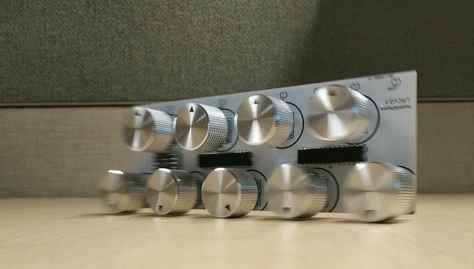

# Encoder2MIDI-Lightoom-Controller
Use Rotary Encoders to control Lightroom (or anything) via Arduino and MIDI connection

## Getting Started

This is created to use several rotary encoders as contoller knobs to adjust lightroom sliders

### How it works

Rotary Encoder/Button > Arduino > MIDI signal over USB > MIDI2LR Plugin > Lightroom

### Prerequisites

Used Libraries
 - https://github.com/adafruit/Adafruit-MCP23017-Arduino-Library/
 - https://github.com/arduino-libraries/MIDIUSB

Lighroom uses the MIDI2LR Plug-in
 - https://rsjaffe.github.io/MIDI2LR/
 - MIDI2LR.xml is a pre-made preset for MIDI2LR

### Hardware

Tested:
 - Arduino Pro Micro

Should Work:
 - Arduino Leonardo
 - Atmega 32U4 based microcontroller

Schematics & PCB: https://easyeda.com/phcreery/lightroom-controller

#### Wiring Example

## Goals
This is the list of future changes:

 - [X] Send MIDI commands
 - [X] Clean Up code to smooth adaptivity (ex. allow more than 2 MCP devices and more encoders)
 - [x] Use interrupts instead of pooling. This will allow smoother input and less power usage
 - [X] Bottons - Short
 - [ ] Bottons - Long, Double, Press & Turn.
 - [X] LEDs
 - [X] Banks/Modes
 - [ ] Multi-Encoder Rotation.

## Authors

* **Peyton Creery** - *Initial work* - [Website](https://twinsphotography.net)
